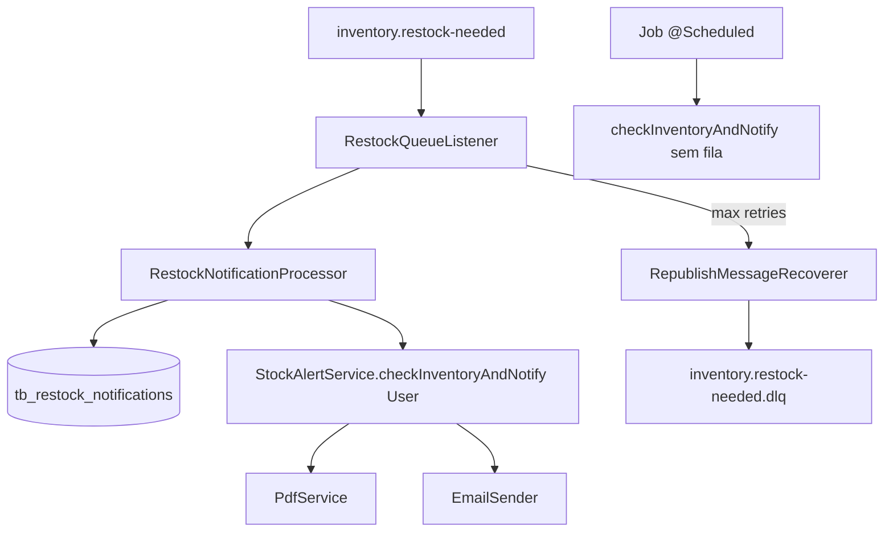

# Notificações resilientes de reposição Design

**Spec**: `.specs/features/resilient-restock-notifications/spec.md`
**Context**: `.specs/features/resilient-restock-notifications/context.md`
**Status**: Draft

---

## Architecture Overview

O fluxo de publicação (`BatchService` → `RestockNeededEvent` → `RestockEventPublisher` → fila) permanece. O consumidor deixa de confirmar falhas transitórias de PDF/e-mail: um processador em `notification` persiste estado por `eventId`, delega ao `StockAlertService` existente e propaga exceção para o retry do Spring. Após esgotar tentativas, `RepublishMessageRecoverer` envia a mensagem para a DLQ.



**Abordagens consideradas**

| Abordagem | Prós | Contras |
| --- | --- | --- |
| **A — Spring retry + RepublishMessageRecoverer** (recomendada) | Integrada ao Boot 3, pouca config, DLQ explícita | Menos controle fino de backoff |
| B — NACK/requeue manual | Controle total por header | Fácil gerar loop ou perder mensagem |
| C — Fila delay + TTL | Backoff previsível | Mais filas e operação |

**Escolha**: A — atende overview com menor superfície.

---

## Code Reuse Analysis

### Existing Components to Leverage

| Component | Location | How to Use |
| --- | --- | --- |
| `RestockQueueMessage` | `inventory/event/RestockQueueMessage.java` | Contrato da mensagem inalterado |
| `RestockQueueListener` | `notification/event/RestockQueueListener.java` | Delegar ao processador; relançar em falha transitória |
| `StockAlertService` | `notification/service/StockAlertService.java` | Reutilizar `checkInventoryAndNotify(User)`; job intacto |
| `RestockQueueConfig` | `inventory/config/RestockQueueConfig.java` | Adicionar bean DLQ, recoverer, constantes de nome |
| Testes de integração | `RestockNeededEventIntegrationTest`, `RestockPublishFailureIntegrationTest` | Estender padrão PostgreSQL + RabbitMQ Testcontainers |
| Flyway | `db/migration/V1__*.sql` | Nova `V5__*` para histórico |

### Integration Points

| System | Integration Method |
| --- | --- |
| PostgreSQL | JPA entity + unique index em `event_id` |
| RabbitMQ | Fila DLQ durável; `SimpleRabbitListenerContainerFactory` com retry e recoverer |
| Resend | Sem mudança; falhas propagadas para retry |

---

## Components

### `RestockNotification` (entity)

- **Purpose**: Histórico e idempotência por `eventId`.
- **Location**: `notification/entity/RestockNotification.java`
- **Fields**: `id`, `eventId` (UUID, unique), `ownerId`, `productId`, `occurredAt`, `status` (enum), `failureReason` (nullable), `createdAt`, `updatedAt`
- **Dependencies**: JPA

### `RestockNotificationRepository`

- **Purpose**: Persistência e lookup por `eventId`.
- **Location**: `notification/repository/RestockNotificationRepository.java`
- **Interfaces**: `Optional<RestockNotification> findByEventId(UUID eventId)`

### `RestockNotificationProcessor`

- **Purpose**: Orquestra validação, idempotência, transição de estado e alerta.
- **Location**: `notification/service/RestockNotificationProcessor.java`
- **Interfaces**:
  - `void process(RestockQueueMessage message)` — `@Transactional`; retorna silenciosamente em idempotência `SENT`; lança exceção em falha de PDF/e-mail
- **Dependencies**: `RestockNotificationRepository`, `UserRepository`, `StockAlertService`
- **Behavior**:
  1. Validar campos (incompleto → log + return sem throw — listener ACK).
  2. Se `SENT` → return.
  3. Insert `PENDING` ou carregar existente `PENDING`/`FAILED` em retry.
  4. Resolver owner; se ausente → `FAILED` permanente, return.
  5. Chamar `stockAlertService.checkInventoryAndNotify(owner)`.
  6. Marcar `SENT` (com ou sem e-mail enviado).
  7. Em exceção de PDF/e-mail: manter `PENDING` (ou atualizar `failureReason`), relançar para retry.

### `RestockQueueListener` (ajuste)

- **Purpose**: Adaptador AMQP fino.
- **Location**: `notification/event/RestockQueueListener.java`
- **Behavior**: Delegar a `RestockNotificationProcessor`; não engolir exceções transitórias.

### `RestockQueueConfig` (extensão)

- **Purpose**: Filas, DLQ, recoverer.
- **Location**: `inventory/config/RestockQueueConfig.java`
- **New constants**: `RESTOCK_NEEDED_DLQ = "inventory.restock-needed.dlq"`
- **Beans**: `Queue restockNeededDlq()`, `@Bean MessageRecoverer republishRecoverer(RabbitTemplate)`

### `application.yaml`

- **Purpose**: Retry do listener.
- **Keys**: `spring.rabbitmq.listener.simple.retry.enabled`, `max-attempts` ligado a `RESTOCK_NOTIFICATION_MAX_ATTEMPTS`, `default-requeue-rejected: false`

---

## Data Model

```sql
-- V5__Create_Restock_Notifications.sql (conceitual)
CREATE TABLE tb_restock_notifications (
    id              BIGSERIAL PRIMARY KEY,
    event_id        UUID         NOT NULL UNIQUE,
    owner_id        BIGINT       NOT NULL,
    product_id      BIGINT       NOT NULL,
    occurred_at     TIMESTAMP    NOT NULL,
    status          VARCHAR(20)  NOT NULL,
    failure_reason  TEXT,
    created_at      TIMESTAMP    NOT NULL DEFAULT CURRENT_TIMESTAMP,
    updated_at      TIMESTAMP    NOT NULL DEFAULT CURRENT_TIMESTAMP,
    CONSTRAINT fk_restock_notification_owner
        FOREIGN KEY (owner_id) REFERENCES tb_users (id)
);
CREATE INDEX idx_restock_notifications_status ON tb_restock_notifications (status);
```

Enum Java: `PENDING`, `SENT`, `FAILED`.

---

## Risks & Concerns

| Concern | Mitigation |
| --- | --- |
| Regressão RABBIT-10 (ACK em falha de e-mail) | Spec RESNOT-06/07 substituem comportamento; atualizar testes existentes |
| Corrida entre duas entregas do mesmo `eventId` | Unique constraint + tratar `DataIntegrityViolationException` relendo `SENT` |
| Listener retry conta tentativa antes do processador marcar `SENT` | Testes de integração com mock falhando N-1 vezes |
| Fila DLQ não declarada no broker | Bean `Queue` durável na config, como fila principal |

---

## Requirement Mapping

| ID | Component |
| --- | --- |
| RESNOT-01–05 | `RestockNotificationProcessor` + migration |
| RESNOT-06–09 | Listener + yaml retry + recoverer |
| RESNOT-10–12 | Processor branches + tests |
| RESNOT-13–14 | Job unchanged; teste de não-inserção |
| RESNOT-15–16 | Unique constraint; sem imports inventory→notification entity |
