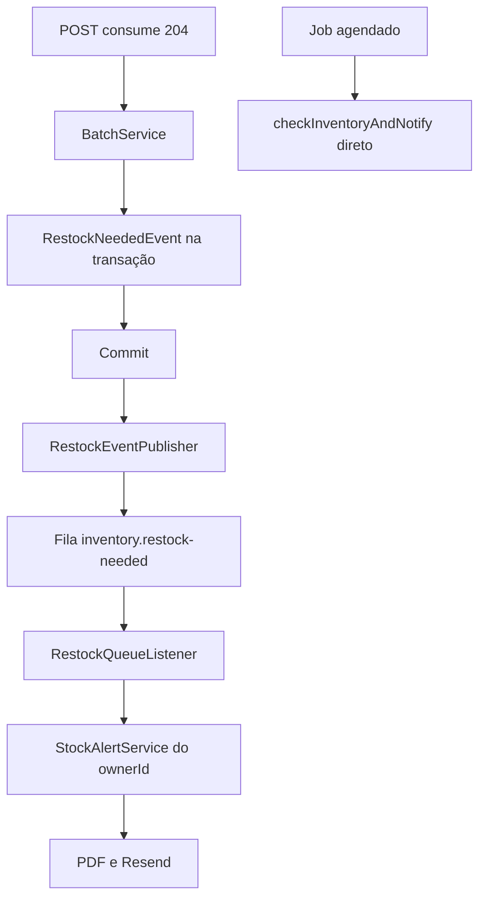

# Fila de reposição Design

**Spec**: `.specs/features/restock-queue/spec.md`
**Context**: `.specs/features/restock-queue/context.md`
**Status**: Draft

---

## Architecture Overview

`BatchService` continua publicando `RestockNeededEvent` dentro da transação. Um publicador em `inventory` escuta `AFTER_COMMIT`, lê o `ownerId` autenticado e envia uma mensagem persistente para a fila durável `inventory.restock-needed`, pela exchange padrão. `notification` deixa de escutar o evento in-process. Um `@RabbitListener` confirma a mensagem depois de reler o estoque baixo daquele proprietário, gerar o PDF e enviar o e-mail. Exceção no publicador ou no consumidor não volta para a transação e não falha o `204`.



Não há exchange própria, retry, DLQ nem outbox.

---

## Code Reuse Analysis

### Existing Components to Leverage

| Component | Location | How to Use |
| --- | --- | --- |
| `RestockNeededEvent` | `backend/src/main/java/br/com/hanrry/inventory/inventory/event/RestockNeededEvent.java` | Continua o sinal in-process. O publicador lê `eventId`, `productId` e `occurredAt` |
| `BatchService.consumeStock` | `backend/src/main/java/br/com/hanrry/inventory/inventory/service/BatchService.java` | Não muda o gatilho nem a publicação do evento de aplicação |
| `StockAlertService` | `backend/src/main/java/br/com/hanrry/inventory/notification/service/StockAlertService.java` | O job segue no método sem argumento. O consumidor usa um método novo com `User` |
| `ProductRepository.findLowStockProducts` | `backend/src/main/java/br/com/hanrry/inventory/product/repository/ProductRepository.java` | A consulta por proprietário já existe. Falta um caminho que não chame `OwnerContext` |
| `EmailSender` e `PdfService` | `notification/email`, `notification/document` | O consumidor reutiliza os dois. Não muda PDF, assunto nem `RESEND_TO` |
| Testcontainers PostgreSQL | `backend/src/test/java/br/com/hanrry/inventory/notification/integration/RestockNeededEventIntegrationTest.java` | O mesmo teste ganha um `RabbitMQContainer` |

### Integration Points

| System | Integration Method |
| --- | --- |
| RabbitMQ | `spring-boot-starter-amqp`, fila durável, mensagem persistente em JSON |
| PostgreSQL | Sem migration. Estoque e log continuam como estão |
| Resend | Só no consumidor, depois do `204` |
| Compose | Serviço `rabbitmq` na rede já usada pela API |

---

## Components

### RestockQueueConfig

- **Purpose**: Declara a fila durável, o conversor JSON e a persistência da mensagem.
- **Location**: `backend/src/main/java/br/com/hanrry/inventory/inventory/config/RestockQueueConfig.java`
- **Interfaces**:
  - `Queue restockNeededQueue(): Queue` - fila durável `inventory.restock-needed`
  - `MessageConverter jsonMessageConverter(): MessageConverter` - `Jackson2JsonMessageConverter`
  - `RabbitTemplate rabbitTemplate(ConnectionFactory, MessageConverter): RabbitTemplate` - `deliveryMode` persistente
- **Dependencies**: `spring-boot-starter-amqp`
- **Reuses**: Jackson já presente pelo `spring-boot-starter-web`

### RestockQueueMessage

- **Purpose**: Corpo da mensagem na fila.
- **Location**: `backend/src/main/java/br/com/hanrry/inventory/inventory/event/RestockQueueMessage.java`
- **Interfaces**:
  - `record RestockQueueMessage(UUID eventId, Long productId, Instant occurredAt, Long ownerId)`
- **Dependencies**: nenhuma
- **Reuses**: os três campos de `RestockNeededEvent` mais `ownerId`

### RestockEventPublisher

- **Purpose**: Envia a mensagem só depois do commit e engole falha de broker.
- **Location**: `backend/src/main/java/br/com/hanrry/inventory/inventory/event/RestockEventPublisher.java`
- **Interfaces**:
  - `void on(RestockNeededEvent event)` - `@TransactionalEventListener(phase = AFTER_COMMIT)`
- **Dependencies**: `RabbitTemplate`, `OwnerContext`, fila `inventory.restock-needed`
- **Reuses**: `RestockNeededEvent`. Não importa `notification`
- **Behavior**: lê `ownerContext.currentUser()`. Se o owner ou o broker falhar, registra log com `eventId` e não relança. Não publica se não houver proprietário autenticado.

### ProductService.findLowStockProducts(User, Pageable)

- **Purpose**: Releitura de estoque baixo sem `SecurityContext`.
- **Location**: `backend/src/main/java/br/com/hanrry/inventory/product/service/ProductService.java`
- **Interfaces**:
  - `PageResponse<ProductResponseDTO> findLowStockProducts(User owner, Pageable pageable)`
- **Dependencies**: `ProductRepository.findLowStockProducts`
- **Reuses**: a mesma consulta e a mesma fórmula do mapper já usado hoje
- **Behavior**: não chama `OwnerContext`. O método atual, que chama `currentUser()`, permanece para o request HTTP.

### StockAlertService.checkInventoryAndNotify(User)

- **Purpose**: O mesmo alerta, limitado ao proprietário da mensagem.
- **Location**: `backend/src/main/java/br/com/hanrry/inventory/notification/service/StockAlertService.java`
- **Interfaces**:
  - `void checkInventoryAndNotify(User owner)`
  - `void checkInventoryAndNotify()` - permanece o job. Não publica na fila
- **Dependencies**: `ProductService.findLowStockProducts(User, Pageable)`, `PdfService`, `EmailSender`
- **Reuses**: geração de PDF e envio atuais
- **Behavior**: lista vazia não envia e-mail. Condição `totalQuantity <= minStock` e fórmula `minStock - totalQuantity` continuam no relatório existente.

### RestockQueueListener

- **Purpose**: Consome a fila, chama o alerta do proprietário e confirma a mensagem mesmo em falha.
- **Location**: `backend/src/main/java/br/com/hanrry/inventory/notification/event/RestockQueueListener.java`
- **Interfaces**:
  - `void on(RestockQueueMessage message)` - `@RabbitListener(queues = "inventory.restock-needed")`
- **Dependencies**: `StockAlertService`, `UserRepository`
- **Reuses**: `StockAlertService.checkInventoryAndNotify(User)`
- **Behavior**: campo ausente ou usuário inexistente: log e retorno normal, sem e-mail. Falha de PDF ou Resend: log com `eventId` e retorno normal. O modo de ack padrão confirma quando o método não lança.

O listener in-process `RestockNeededEventListener` sai nesta etapa. Se ele permanecer, o e-mail dispara duas vezes.

---

## Data Models

### RestockQueueMessage

```java
public record RestockQueueMessage(
    UUID eventId,
    Long productId,
    Instant occurredAt,
    Long ownerId
) {}
```

**Relationships**: `ownerId` aponta para `tb_users.id`. `productId` é o produto consumido e não filtra o relatório. O relatório continua a releitura de todos os produtos daquele proprietário com `totalQuantity <= minStock`.

Não há tabela nova.

---

## Error Handling Strategy

| Error Scenario | Handling | User Impact |
| --- | --- | --- |
| Commit de `consumeStock` | Publica uma mensagem persistente | `204 No Content` sem esperar e-mail |
| `InsufficientStockException` | Nenhum evento, nenhuma mensagem | Erro atual de estoque insuficiente |
| Broker fora no `AFTER_COMMIT` | Log com `eventId`, exceção engolida | `204`. Alerta daquela requisição pode não sair |
| Sem proprietário autenticado no publish | Log com `eventId`, não publica | `204`. Estoque permanece |
| PDF ou Resend falha no consumidor | Log com `eventId`, método retorna | Estoque permanece. Mensagem confirmada. Sem retry |
| Mensagem sem `eventId`, `productId`, `occurredAt` ou `ownerId` | Log, retorno normal, sem e-mail | Nenhum |
| `ownerId` sem usuário | Log, retorno normal, sem e-mail | Nenhum |
| Consumidor parado | Mensagem fica na fila durável | `204` já foi respondido |
| Job agendado | `checkInventoryAndNotify()` direto | Nenhuma mensagem na fila |

---

## Risks & Concerns

| Concern | Location (file:line) | Impact | Mitigation |
| --- | --- | --- | --- |
| `OwnerContext.currentUser()` lança exceção sem autenticação | `backend/src/main/java/br/com/hanrry/inventory/shared/security/OwnerContext.java:16` | O listener da fila não tem `SecurityContext`. Chamar `checkInventoryAndNotify()` daí engole a exceção e o e-mail do consumo não sai | A mensagem leva `ownerId`. O consumidor chama o método que recebe `User` |
| A releitura HTTP usa o contexto de segurança | `backend/src/main/java/br/com/hanrry/inventory/product/service/ProductService.java:102` | Um consumidor em outro thread mudaria o conjunto de produtos do e-mail | Novo método recebe o `User` e não chama `OwnerContext` |
| Listener in-process ainda envia e-mail | `backend/src/main/java/br/com/hanrry/inventory/notification/event/RestockNeededEventListener.java:18` | Consumo geraria dois alertas | Remover a classe e o teste dela na tarefa do consumidor |
| Exceção no `AFTER_COMMIT` pode falhar o `204` | `backend/src/main/java/br/com/hanrry/inventory/notification/event/RestockNeededEventListener.java:19` | Falha de broker voltaria a quebrar a resposta | O publicador captura a falha e não relança |
| Job sem usuário já quebra em `currentUser()` | `backend/src/main/java/br/com/hanrry/inventory/notification/service/StockAlertService.java:24` | A varredura agendada continua frágil | Fora desta etapa. O job não muda e não publica na fila |
| Teste de integração espera o e-mail no mesmo fio | `backend/src/test/java/br/com/hanrry/inventory/notification/integration/RestockNeededEventIntegrationTest.java:49` | A suíte atual não prova fila nem `204` antes do e-mail | O teste passa a usar RabbitMQ e bloqueia o `EmailSender` para provar que o `204` não espera |

---

## Tech Decisions

| Decision | Choice | Rationale |
| --- | --- | --- |
| Quem publica | `RestockEventPublisher` em `inventory`, `AFTER_COMMIT` | Decisão confirmada. `inventory` não passa a depender de `notification` |
| Topologia | Exchange padrão e uma fila durável | Um produtor e um consumidor. Exchange própria não muda o comportamento desta etapa |
| Formato | JSON via `Jackson2JsonMessageConverter` | Evita serialização Java do conversor padrão do Spring AMQP |
| Ack em falha | Capturar a exceção e retornar | Confirma a mensagem. Retry e DLQ ficam fora |
| `ownerId` | Campo obrigatório da mensagem | Sem isso o consumidor não consegue repetir a releitura do request |
| Cliente | `spring-boot-starter-amqp` no `pom.xml` já em Spring Boot 3.3.5 | Não fixar versão à parte da do parent |
| Teste de broker | `org.testcontainers:rabbitmq` `1.21.4`, o mesmo BOM já usado no PostgreSQL | A suíte de integração já sobe container |

Nenhuma destas decisões vira padrão para outro módulo. A arquitetura já limita o RabbitMQ a este caminho. Não há `AD` novo em `.specs/STATE.md`.
