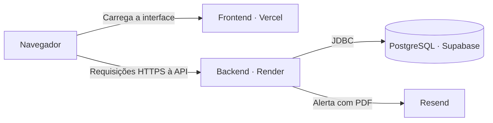

# Controle de Estoque [](https://github.com/hanrrysantos/inventory-manager/actions/workflows/maven.yml)


API REST para controle de estoque por lotes, com foco em validade, rastreabilidade e consistência de movimentações concorrentes. Desenvolvida em Java 21 e Spring Boot 3, com frontend e API disponíveis para demonstração.

| Recurso | Descrição | Link de Acesso |
| :--- | :--- | :--- |
| **Aplicação Web** | Sistema em produção | [controle-de-estoque.hanrry.top](https://controle-de-estoque.hanrry.top/) |
| **Documentação API** | Interface Swagger UI para testes dos endpoints | [api-controle-de-estoque.hanrry.top/swagger-ui/index.html](https://api-controle-de-estoque.hanrry.top/swagger-ui/index.html) |
| **Código Frontend** | Repositório com o código-fonte da interface | [github.com/hanrrysantos/inventory-manager-frontend](https://github.com/hanrrysantos/inventory-manager-frontend) |

> 💡 As operações administrativas exigem permissão de `ADMIN`. O passo a passo detalhado de autenticação pode ser consultado na seção [Como usar a API](#como-usar-a-api).

## Sumário

- [Sobre o projeto](#sobre-o-projeto)
- [Funcionalidades](#funcionalidades)
- [Desafios técnicos e soluções](#desafios-técnicos-e-soluções)
- [Tecnologias](#tecnologias)
- [Arquitetura](#arquitetura)
- [Deploy e infraestrutura](#deploy-e-infraestrutura)
- [Como executar](#como-executar)
- [Como usar a API](#como-usar-a-api)
- [Testes e qualidade](#testes-e-qualidade)
- [Próximos passos](#próximos-passos)
- [Autor](#autor)

## Sobre o projeto

Em cenários de alto volume, falhas na gestão de estoque costumam gerar divergências no saldo por conta de movimentações concorrentes, além de prejuízos causados pelo vencimento de produtos. Para resolver esse desafio de confiabilidade, desenvolvi o Controle de Estoque: uma solução centralizada criada para garantir a integridade dos dados, automatizar a priorização de consumo por validade e manter auditoria total sobre o fluxo de mercadorias.

A aplicação combina uma API REST em Java 21 e Spring Boot 3 integrada ao PostgreSQL, com controle transacional rigoroso para operações simultâneas, lógica de consumo baseada no critério FEFO (First Expire, First Out) e alertas automatizados de estoque baixo com emissão de relatórios em PDF. O resultado é uma arquitetura resiliente e pronta para produção, acessível por interface web e API, validada por uma suíte de testes de integração que cobre cenários reais de concorrência e rollback.

## Funcionalidades

- Cadastro de produtos, categorias, usuários e lotes com quantidade, preço e validade.
- Entrada e consumo de estoque por FEFO, com histórico de movimentações e proteção contra consumo concorrente.
- Consulta de estoque baixo, lotes vencidos e resumo do dashboard.
- Autenticação JWT, permissões `ADMIN`/`USER` e consulta do usuário autenticado.
- Verificação agendada de estoque baixo e envio de alertas via Resend com relatório PDF.
- CORS configurável para integração com o frontend e documentação OpenAPI/Swagger.

## Desafios técnicos e soluções

### 1. Preservar a integridade do estoque sob operações concorrentes

- **Situação:** Duas requisições podem tentar consumir o mesmo saldo ou adicionar quantidades ao mesmo lote simultaneamente.
- **Tarefa:** Impedir o problema de *race condition* (consumo além do disponível e perda de atualizações nas entradas).
- **Ação:** Aplicação de bloqueios pessimistas (`PESSIMISTIC_WRITE`) nas consultas de leitura para escrita dentro de transações Spring/JPA, validados via testes de concorrência com PostgreSQL e Testcontainers
- **Resultado:** Garantia de que apenas uma operação é consumida quando o saldo é insuficiente para ambas, mantendo a consistência dos dados até o *commit*.

[Ver os testes de concorrência](src/test/java/br/com/hanrry/inventory/inventory/integration/InventoryConcurrencyIntegrationTest.java).

### 2. Consumo inteligente por validade (FEFO) e rollback transacional

- **Situação:** Um pedido pode exigir saldo de vários lotes, necessitando ignorar itens vencidos e resolver empates em datas idênticas.
- **Tarefa:** Aplicar FEFO (primeiro a vencer, primeiro a sair), excluir lotes vencidos e manter saldo e histórico consistentes se faltar estoque.
- **Ação:** Seleção de lotes válidos com saldo positivo, ordenação por validade e ID como desempate, além do registro das saídas na mesma transação do consumo.
- **Resultado:** Garantia de consumo correto por validade e *rollback* automático (reversão total de saldos e logs) se a quantidade solicitada não for atendida por completo.

[Ver os testes transacionais](src/test/java/br/com/hanrry/inventory/inventory/integration/InventoryTransactionIntegrationTest.java).

### 3. Automação e consolidação de alertas de estoque baixo

- **Situação:** Identificar e reportar a escassez de produtos sem sobrecarregar a verificação manual ou gerar envios redundantes.
- **Tarefa:** Automatizar a verificação de produtos abaixo do limite mínimo e consolidar os dados para reposição.
- **Ação:** Execução agendada (`@Scheduled`) e engatada ao fluxo de consumo, gerando relatórios dinâmicos em PDF com OpenPDF e enviando via Resend API por meio do padrão `EmailSender`.
- **Resultado:** Notificação automatizada com anexo PDF contendo o relatório de reposição.

[Ver os testes de notificação](src/test/java/br/com/hanrry/inventory/notification). O processamento assíncrono das notificações faz parte dos [próximos passos](#próximos-passos).

## Tecnologias

| Área | Tecnologias e aplicação |
| :--- | :--- |
| API | Java 21, Spring Boot 3 e Jakarta Bean Validation para endpoints REST e validação de entrada. |
| Segurança | Spring Security, JWT e BCrypt para autenticação e controle de acesso por perfil (`ADMIN`/`USER`). |
| Persistência | PostgreSQL, Spring Data JPA e Flyway para modelagem relacional, gestão de transações e versionamento do banco. |
| Contratos | DTOs, MapStruct e OpenAPI (Swagger UI) para mapeamento de entidades e documentação interativa. |
| Notificações | Resend API para envio de e-mails e OpenPDF para geração dinâmica do relatório de reposição. |
| Testes | JUnit 5, Mockito, MockMvc e Testcontainers (PostgreSQL); relatório de cobertura com JaCoCo. |
| Execução e CI | Maven Wrapper, Docker, Docker Compose e GitHub Actions para integração contínua. |

## Arquitetura

A aplicação é executada como uma única unidade e possui organização por domínio. Essa estrutura reúne responsabilidades relacionadas e permite evoluir o projeto incrementalmente.

| Módulo | Responsabilidade |
| :--- | :--- |
| `auth` | Login, autenticação JWT e regras de acesso. |
| `user` | Cadastro e gestão de usuários. |
| `product` | Catálogo de produtos e categorias. |
| `inventory` | Lotes, entradas, consumo FEFO e histórico de movimentações. |
| `dashboard` | Consultas de resumo do estoque. |
| `notification` | Alertas de estoque baixo, envio de e-mail e geração de PDF. |
| `shared` | Configurações e tratamento de erros compartilhados. |

O código de produção fica em `src/main/java/br/com/hanrry/inventory`, os testes em `src/test/java/br/com/hanrry/inventory` e as migrations em `src/main/resources/db/migration`.

Consulte [as decisões arquiteturais](docs/architecture.md) e [os planos de evolução](docs/plans/). O documento de arquitetura descreve o estado desejado e inclui componentes ainda não implementados, como RabbitMQ e a infraestrutura de observabilidade.

## Deploy e infraestrutura

- **Situação:** A demonstração do projeto precisa integrar interface web, API REST e banco de dados em um ambiente público e acessível pela internet.
- **Tarefa:** Disponibilizar o fluxo completo de gestão de estoque para avaliação online, distribuindo os componentes em serviços de hospedagem adequados.
- **Ação:** Publicação do frontend na Vercel, do backend no Render e do banco PostgreSQL no Supabase, com integração ao Resend para envio de e-mails dinâmicos.
- **Resultado:** Aplicação 100% funcional em produção, acessível via interface web e Swagger sem a necessidade de execução local.

| Componente | Plataforma | Responsabilidade e acesso |
| :--- | :--- | :--- |
| Frontend | Vercel | Interface web em [controle-de-estoque.hanrry.top](https://controle-de-estoque.hanrry.top/). |
| Backend | Render | API Spring Boot com [api-controle-de-estoque.hanrry.top/swagger-ui/index.html](https://api-controle-de-estoque.hanrry.top/swagger-ui/index.html). |
| Banco de dados | Supabase | PostgreSQL utilizado pelo backend para persistir usuários, catálogo, lotes e movimentações. |
| E-mail | Resend | Envio dos alertas de estoque baixo com relatório PDF gerado pelo backend. |



> 💡 A interface no navegador consome diretamente os endpoints da API, que centraliza a autenticação, regras de negócio e persistência. O Supabase é utilizado estritamente como provedor PostgreSQL gerenciado — toda a autenticação e autorização da aplicação são tratadas pelo próprio backend via Spring Security e JWT.

## Como executar

### Com Docker Compose

Pré-requisito: Docker com Compose. Na raiz do repositório:

```bash
git clone [https://github.com/hanrrysantos/inventory-manager.git](https://github.com/hanrrysantos/inventory-manager.git)
cd inventory-manager
cp .env.example .env
# Edite a .env antes de iniciar.
docker compose up -d --build
```

Se já possui uma `.env`, atualize-a usando o exemplo como referência, sem sobrescrevê-la. O Compose inicia a API e o PostgreSQL, com dados persistidos em volume. As migrations Flyway são aplicadas na inicialização.

- Swagger: http://localhost:8080/swagger-ui/index.html
- OpenAPI JSON: http://localhost:8080/v3/api-docs
- Logs: `docker compose logs -f api`
- Encerrar: `docker compose down` (preserva o volume do banco).

### Variáveis de ambiente

Use [.env.example](.env.example) como referência e mantenha a `.env` fora do versionamento.

| Variável | Uso |
| :--- | :--- |
| `API_PORT` | Porta da API no host pelo Compose; padrão `8080`. |
| `POSTGRES_DB`, `POSTGRES_USER`, `POSTGRES_PASSWORD` | Banco e credenciais do PostgreSQL no Compose. |
| `DB_URL`, `DB_USERNAME`, `DB_PASSWORD` | Conexão JDBC ao executar fora do Compose; nele, são definidas automaticamente. |
| `JWT_SECRET` | Segredo de assinatura; use um valor aleatório com pelo menos 32 bytes. |
| `JWT_EXPIRATION` | Validade do token em milissegundos; exemplo: `3600000` (1 hora). |
| `FRONTEND_ORIGINS` | Origens CORS separadas por vírgulas; padrão `http://localhost:5173`. |
| `RESEND_API_KEY` | Chave de API para envio de e-mails. |
| `RESEND_FROM`, `RESEND_TO` | Remetente autorizado no Resend e destinatário dos alertas. |

> 💡 Dica CORS: Para liberar múltiplos ambientes no frontend, configure a variável separando as origens por vírgulas

```bash
FRONTEND_ORIGINS=http://localhost:5173,https://meu-frontend.com
```

### Com Maven ou IDE

Pré-requisitos: Java 21, Maven 3.9+ e uma instância do PostgreSQL acessível. 

Configure as variáveis da API acima.

Execute:

```bash
bash ./mvnw spring-boot:run
```

> 💡 A porta padrão é `8080` e pode ser alterada com `PORT`. O PostgreSQL do Compose não publica uma porta no host; para rodar via Maven/IDE, use uma instância acessível ou configure explicitamente essa publicação.

## Como usar a API

No Swagger local ou da demonstração, cadastre um usuário em `POST /api/v1/auth/register` e faça login em `POST /api/v1/auth/login`. Copie o campo `token` da resposta e cole em **Authorize**, sem o prefixo `Bearer`. Em chamadas HTTP, use `Authorization: Bearer <token>`.

| Método | Endpoint | Finalidade |
| :--- | :--- | :--- |
| `GET` | `/api/v1/users/me` | Usuário autenticado e sua role. |
| `GET` | `/api/v1/dashboard/summary` | Resumo do estoque. |
| `GET` | `/api/v1/products` | Lista de produtos. |
| `GET` | `/api/v1/products/low-stock` | Produtos com estoque baixo. |
| `GET` | `/api/v1/categories` | Lista de categorias. |
| `POST` | `/api/v1/batches` | Cadastro de lote. |
| `PATCH` | `/api/v1/batches/{id}/add` | Entrada de quantidade no lote. |
| `POST` | `/api/v1/batches/consume` | Consumo de estoque por FEFO. |
| `GET` | `/api/v1/batches/expired` | Lotes vencidos. |
| `GET` | `/api/v1/users` | Lista de usuários (`ADMIN`). |

`USER` e `ADMIN` podem consultar produtos/categorias, consumir estoque e adicionar quantidades. Gestão de usuários, alterações no catálogo e cadastro de lotes exigem `ADMIN`. Consulte o Swagger para os contratos completos.

Após o login, um exemplo de consulta ao usuário autenticado na API local:

```bash
curl http://localhost:8080/api/v1/users/me \
  -H 'Authorization: Bearer <token-retornado-no-login>'
```

Exemplo ilustrativo de resposta `200 OK`:

```json
{
  "id": 1,
  "name": "Maria Silva",
  "email": "maria@example.com",
  "role": "USER",
  "createdAt": "2026-01-15T10:00:00"
}
```

## Testes e qualidade

Com Java 21 e Docker disponível para os testes de integração com PostgreSQL:

```bash
bash ./mvnw clean test
```

A suíte inclui testes unitários, de API e de integração, com cenários de FEFO, rollback e concorrência. O relatório de cobertura é gerado em `target/site/jacoco/index.html`.

Para exercitar riscos que dependem do comportamento real do banco, os testes de integração utilizam PostgreSQL em containers. Os cenários cobrem migrations, persistência, isolamento entre operações concorrentes e atomicidade das movimentações.

O [workflow de CI](.github/workflows/maven.yml) executa a suíte com JaCoCo e constrói a imagem Docker em pushes e pull requests para `main`. O status das execuções pode ser acompanhado no [GitHub Actions](https://github.com/hanrrysantos/inventory-manager/actions).

## Próximos passos

A evolução prevista em [architecture.md](docs/architecture.md) inclui:

- Publicação de eventos de reposição após a confirmação da transação.
- Processamento assíncrono de notificações com RabbitMQ.
- Persistência do estado das notificações, idempotência, retry e fila de mensagens não processadas (DLQ).
- Observabilidade com Actuator, Micrometer, Prometheus e Grafana.

Esses itens representam trabalho futuro. A implementação atual envia alertas de forma síncrona; o desacoplamento busca impedir que falhas externas afetem movimentações de estoque.

## Autor

[Hanrry Santos](https://github.com/hanrrysantos) · [LinkedIn](https://www.linkedin.com/in/hanrrysantos)
