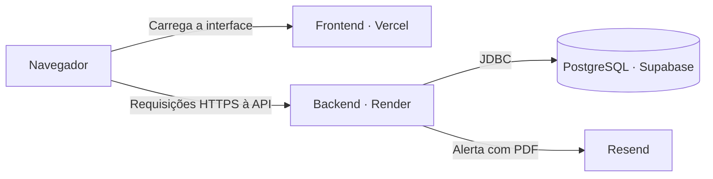

# Inventory Manager

API REST para controle de estoque por lotes, com foco em validade, rastreabilidade e consistência de movimentações concorrentes. Desenvolvida em Java 21 e Spring Boot 3, com frontend e API disponíveis para demonstração.

**[Acessar o site](https://controledeestoque.hanrry.top/) · [Explorar o Swagger](https://inventory.hanrry.top/swagger-ui/index.html) · [Repositório do frontend](https://github.com/hanrrysantos/inventory-manager-frontend)**

[](https://openjdk.org/)
[](https://spring.io/projects/spring-boot)
[](https://www.postgresql.org/)
[](https://www.docker.com/)
[](https://github.com/hanrrysantos/inventory-manager/actions/workflows/maven.yml)

## Sumário

- [Sobre o projeto](#sobre-o-projeto)
- [Demonstração](#demonstração)
- [Funcionalidades](#funcionalidades)
- [Desafios técnicos e soluções](#desafios-técnicos-e-soluções)
- [Tecnologias](#tecnologias)
- [Arquitetura](#arquitetura)
- [Deploy e infraestrutura](#deploy-e-infraestrutura)
- [Como executar](#como-executar)
- [Como usar a API](#como-usar-a-api)
- [Testes e qualidade](#testes-e-qualidade)
- [Próximos passos](#próximos-passos)
- [Contribuição](#contribuição)
- [Autor e licença](#autor-e-licença)

## Sobre o projeto

Controlar estoque exige acompanhar a validade de cada lote, registrar entradas e saídas e lidar com operações simultâneas. Um saldo incorreto pode comprometer tanto o consumo quanto a decisão de reposição.

O Inventory Manager foi desenvolvido para reunir essas responsabilidades em uma aplicação: organizar o catálogo, priorizar o consumo dos lotes que vencem primeiro e manter o histórico das movimentações. A solução combina uma API com autenticação JWT, persistência em PostgreSQL, controle transacional e alertas de estoque baixo por e-mail com PDF.

O resultado é um fluxo de gestão acessível pela interface web e pela API, com testes de integração que verificam cenários de validade, concorrência e reversão de operações incompletas. Os casos abaixo mostram as decisões técnicas e os comportamentos cobertos pela suíte.

## Demonstração

- **Interface web:** [controledeestoque.hanrry.top](https://controledeestoque.hanrry.top/).
- **API interativa:** [Swagger da demonstração](https://inventory.hanrry.top/swagger-ui/index.html).
- **Código da interface:** [inventory-manager-frontend](https://github.com/hanrrysantos/inventory-manager-frontend).

Para conhecer o projeto, comece pela interface web. Para explorar os contratos da API, abra o Swagger, cadastre um usuário, faça login e utilize o token em **Authorize**. Consulte produtos, categorias e o resumo do estoque; operações administrativas dependem da permissão `ADMIN`. O passo a passo de autenticação está em [Como usar a API](#como-usar-a-api).

## Funcionalidades

- Cadastro de produtos, categorias, usuários e lotes com quantidade, preço e validade.
- Entrada e consumo de estoque por FEFO, com histórico de movimentações e proteção contra consumo concorrente.
- Consulta de estoque baixo, lotes vencidos e resumo do dashboard.
- Autenticação JWT, permissões `ADMIN`/`USER` e consulta do usuário autenticado.
- Verificação agendada de estoque baixo e envio de alertas via Resend com relatório PDF.
- CORS configurável para integração com o frontend e documentação OpenAPI/Swagger.

## Desafios técnicos e soluções

### Preservar o estoque durante operações concorrentes

- **Situação:** duas requisições podem tentar consumir o mesmo saldo ou adicionar quantidades ao mesmo lote simultaneamente.
- **Tarefa:** impedir consumo acima do disponível e perda de atualizações nas entradas de estoque.
- **Ação:** uso de transações e bloqueios pessimistas (`PESSIMISTIC_WRITE`) nas consultas de consumo e adição, com testes concorrentes contra PostgreSQL via Testcontainers.
- **Resultado:** a suíte verifica que apenas um consumo é concluído quando o saldo não atende aos dois, que o bloqueio permanece até o commit e que entradas simultâneas são preservadas.

[Ver os testes de concorrência](src/test/java/br/com/hanrry/inventory/inventory/integration/InventoryConcurrencyIntegrationTest.java).

### Consumir por validade sem deixar movimentações parciais

- **Situação:** um pedido pode exigir saldo de vários lotes, incluindo lotes vencidos ou com a mesma data de validade.
- **Tarefa:** aplicar FEFO (primeiro a vencer, primeiro a sair), excluir lotes vencidos e manter saldo e histórico consistentes se faltar estoque.
- **Ação:** seleção de lotes válidos com saldo positivo, ordenação por validade e ID como desempate, além do registro das saídas na mesma transação do consumo.
- **Resultado:** os testes verificam a ordem de consumo, a exclusão de lotes vencidos, o desempate determinístico e o rollback de saldos e registros quando a quantidade solicitada não pode ser atendida.

[Ver os testes transacionais](src/test/java/br/com/hanrry/inventory/inventory/integration/InventoryTransactionIntegrationTest.java).

### Transformar estoque baixo em informação para reposição

- **Situação:** identificar produtos abaixo do limite exige reunir dados do estoque e comunicá-los ao responsável.
- **Tarefa:** automatizar a verificação e entregar um relatório que apoie a reposição.
- **Ação:** consulta de estoque baixo, geração de PDF com OpenPDF e envio pelo Resend através da interface `EmailSender`. A verificação é agendada e também chamada no fluxo de consumo.
- **Resultado:** o fluxo reúne os produtos identificados em um alerta com anexo PDF. Há testes para a orquestração do alerta, a geração do documento e a integração com o cliente de e-mail.

[Ver os testes de notificação](src/test/java/br/com/hanrry/inventory/notification). O processamento assíncrono das notificações faz parte dos [próximos passos](#próximos-passos).

## Tecnologias

| Área | Tecnologias e aplicação |
| :--- | :--- |
| API | Java 21, Spring Boot 3 e Bean Validation para endpoints REST e validação de entrada. |
| Segurança | Spring Security, JWT e BCrypt para autenticação e autorização por perfil. |
| Persistência | PostgreSQL, Spring Data JPA e Flyway para dados, transações e migrations. |
| Contratos | DTOs, MapStruct e OpenAPI/Swagger para mapeamento e documentação da API. |
| Notificações | Resend para e-mails e OpenPDF para relatórios de reposição. |
| Testes | JUnit 5, Mockito, MockMvc e Testcontainers; cobertura com JaCoCo. |
| Execução e CI | Maven Wrapper, Docker, Docker Compose e GitHub Actions. |

## Arquitetura

A aplicação é executada como uma única unidade e possui organização por domínio. Essa estrutura reúne responsabilidades relacionadas e permite evoluir o projeto incrementalmente.

| Módulo | Responsabilidade |
| :--- | :--- |
| `auth` | Login, autenticação JWT e regras de acesso. |
| `user` | Cadastro e gestão de usuários. |
| `product` | Catálogo de produtos e categorias. |
| `inventory` | Lotes, entradas, consumo FEFO e histórico de movimentações. |
| `dashboard` | Consultas de resumo do estoque. |
| `notification` | Alertas de estoque baixo, envio de e-mail e geração de PDF. |
| `shared` | Configurações e tratamento de erros compartilhados. |

O código de produção fica em `src/main/java/br/com/hanrry/inventory`, os testes em `src/test/java/br/com/hanrry/inventory` e as migrations em `src/main/resources/db/migration`.

Consulte [as decisões arquiteturais](docs/architecture.md) e [os planos de evolução](docs/plans/). O documento de arquitetura descreve o estado desejado e inclui componentes ainda não implementados, como RabbitMQ e a infraestrutura de observabilidade.

## Deploy e infraestrutura

- **Situação:** a demonstração do projeto precisa reunir interface, API e persistência em um ambiente acessível pela internet.
- **Tarefa:** disponibilizar o fluxo de gestão de estoque para avaliação, com cada componente em seu serviço de hospedagem.
- **Ação:** publicação do frontend na Vercel, do backend no Render e do banco PostgreSQL no Supabase, com envio de e-mails pelo Resend.
- **Resultado:** a aplicação pode ser explorada pelo site e pelo Swagger nos links do início deste README, sem exigir a instalação local para conhecer o projeto.

| Componente | Plataforma | Responsabilidade e acesso |
| :--- | :--- | :--- |
| Frontend | Vercel | Interface web em [controledeestoque.hanrry.top](https://controledeestoque.hanrry.top/). |
| Backend | Render | API Spring Boot em `https://inventory.hanrry.top`, com [Swagger público](https://inventory.hanrry.top/swagger-ui/index.html). |
| Banco de dados | Supabase | PostgreSQL utilizado pelo backend para persistir usuários, catálogo, lotes e movimentações. |
| E-mail | Resend | Envio dos alertas de estoque baixo com relatório PDF gerado pelo backend. |



A interface executada no navegador consome a API, que concentra autenticação, regras de negócio e acesso ao banco. O Supabase fornece o PostgreSQL; a autenticação da aplicação é implementada no backend com Spring Security e JWT.

## Como executar

### Com Docker Compose

Pré-requisito: Docker com Compose. Na raiz do repositório:

```bash
cp .env.example .env
# Edite a .env antes de iniciar.
docker compose up -d --build
```

Se já possui uma `.env`, atualize-a usando o exemplo como referência, sem sobrescrevê-la. O Compose inicia a API e o PostgreSQL, com dados persistidos em volume. As migrations Flyway são aplicadas na inicialização.

- Swagger: http://localhost:8080/swagger-ui/index.html
- OpenAPI JSON: http://localhost:8080/v3/api-docs
- Logs: `docker compose logs -f api`
- Encerrar: `docker compose down` (preserva o volume do banco).

### Variáveis de ambiente

Use [.env.example](.env.example) como referência e mantenha a `.env` fora do versionamento.

| Variável | Uso |
| :--- | :--- |
| `API_PORT` | Porta da API no host pelo Compose; padrão `8080`. |
| `POSTGRES_DB`, `POSTGRES_USER`, `POSTGRES_PASSWORD` | Banco e credenciais do PostgreSQL no Compose. |
| `DB_URL`, `DB_USERNAME`, `DB_PASSWORD` | Conexão JDBC ao executar fora do Compose; nele, são definidas automaticamente. |
| `JWT_SECRET` | Segredo de assinatura; use um valor aleatório com pelo menos 32 bytes. |
| `JWT_EXPIRATION` | Validade do token em milissegundos; exemplo: `3600000` (1 hora). |
| `FRONTEND_ORIGINS` | Origens CORS separadas por vírgulas; padrão `http://localhost:5173`. |
| `RESEND_API_KEY` | Chave de API para envio de e-mails. |
| `RESEND_FROM`, `RESEND_TO` | Remetente autorizado no Resend e destinatário dos alertas. |

Substitua os valores de exemplo de senha e JWT. Para os alertas funcionarem, configure as três variáveis do Resend com valores válidos.

Exemplo para frontend local e publicado:

```dotenv
FRONTEND_ORIGINS=http://localhost:5173,https://meu-frontend.com
```

O Compose lê a `.env` automaticamente. Ao executar pelo Maven ou pela IDE, configure as variáveis no ambiente do processo; a aplicação não carrega a `.env` por conta própria.

### Com Maven ou IDE

Requer Java 21 e PostgreSQL acessível. Configure as variáveis da API acima, incluindo `DB_URL` (por exemplo, `jdbc:postgresql://localhost:5432/inventory`), `DB_USERNAME` e `DB_PASSWORD`.

```bash
bash ./mvnw spring-boot:run
```

A porta padrão é `8080` e pode ser alterada com `PORT`. O PostgreSQL do Compose não publica uma porta no host; para rodar via Maven/IDE, use uma instância acessível ou configure explicitamente essa publicação.

## Como usar a API

No Swagger local ou da demonstração, cadastre um usuário em `POST /api/v1/auth/register` e faça login em `POST /api/v1/auth/login`. Copie o campo `token` da resposta e cole em **Authorize**, sem o prefixo `Bearer`. Em chamadas HTTP, use `Authorization: Bearer <token>`.

| Método | Endpoint | Finalidade |
| :--- | :--- | :--- |
| `GET` | `/api/v1/users/me` | Usuário autenticado e sua role. |
| `GET` | `/api/v1/dashboard/summary` | Resumo do estoque. |
| `GET` | `/api/v1/products` | Lista de produtos. |
| `GET` | `/api/v1/products/low-stock` | Produtos com estoque baixo. |
| `GET` | `/api/v1/categories` | Lista de categorias. |
| `POST` | `/api/v1/batches` | Cadastro de lote. |
| `PATCH` | `/api/v1/batches/{id}/add` | Entrada de quantidade no lote. |
| `POST` | `/api/v1/batches/consume` | Consumo de estoque por FEFO. |
| `GET` | `/api/v1/batches/expired` | Lotes vencidos. |
| `GET` | `/api/v1/users` | Lista de usuários (`ADMIN`). |

`USER` e `ADMIN` podem consultar produtos/categorias, consumir estoque e adicionar quantidades. Gestão de usuários, alterações no catálogo e cadastro de lotes exigem `ADMIN`. Consulte o Swagger para os contratos completos.

Após o login, um exemplo de consulta ao usuário autenticado na API local:

```bash
curl http://localhost:8080/api/v1/users/me \
  -H 'Authorization: Bearer <token-retornado-no-login>'
```

Exemplo ilustrativo de resposta `200 OK`:

```json
{
  "id": 1,
  "name": "Maria Silva",
  "email": "maria@example.com",
  "role": "USER",
  "createdAt": "2026-01-15T10:00:00"
}
```

## Testes e qualidade

Com Java 21 e Docker disponível para os testes de integração com PostgreSQL:

```bash
bash ./mvnw clean test
```

A suíte inclui testes unitários, de API e de integração, com cenários de FEFO, rollback e concorrência. O relatório de cobertura é gerado em `target/site/jacoco/index.html`.

Para exercitar riscos que dependem do comportamento real do banco, os testes de integração utilizam PostgreSQL em containers. Os cenários cobrem migrations, persistência, isolamento entre operações concorrentes e atomicidade das movimentações.

O [workflow de CI](.github/workflows/maven.yml) executa a suíte com JaCoCo e constrói a imagem Docker em pushes e pull requests para `main`. O status das execuções pode ser acompanhado no [GitHub Actions](https://github.com/hanrrysantos/inventory-manager/actions).

## Próximos passos

A evolução prevista em [architecture.md](docs/architecture.md) inclui:

- Publicação de eventos de reposição após a confirmação da transação.
- Processamento assíncrono de notificações com RabbitMQ.
- Persistência do estado das notificações, idempotência, retry e fila de mensagens não processadas (DLQ).
- Observabilidade com Actuator, Micrometer, Prometheus e Grafana.

Esses itens representam trabalho futuro. A implementação atual envia alertas de forma síncrona; o desacoplamento busca impedir que falhas externas afetem movimentações de estoque.

## Contribuição

Para reportar um problema ou sugerir uma melhoria, [abra uma issue](https://github.com/hanrrysantos/inventory-manager/issues) com o contexto, o comportamento esperado e, quando aplicável, os passos para reproduzir.

Para contribuir com código, consulte [as orientações do repositório](AGENTS.md) e [a arquitetura](docs/architecture.md), mantenha a alteração focada e informe no pull request quais testes foram executados. Mudanças no banco devem usar novas migrations Flyway.

## Autor e licença

[Hanrry Santos](https://github.com/hanrrysantos) · [LinkedIn](https://www.linkedin.com/in/hanrrysantos)

Licença declarada: [Apache 2.0](https://www.apache.org/licenses/LICENSE-2.0).
