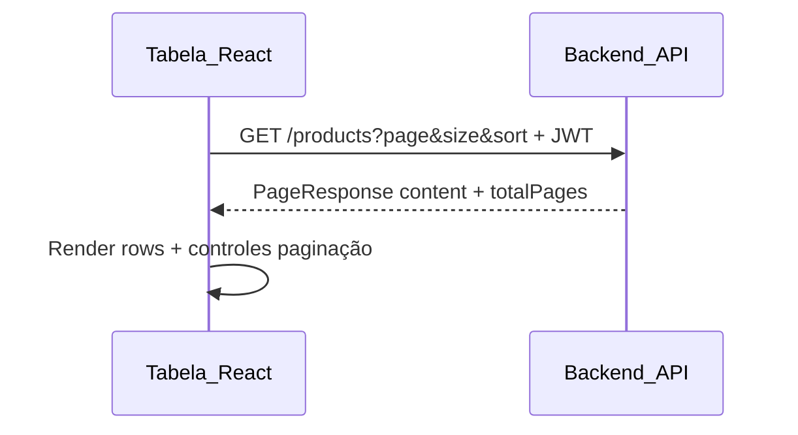

# Paginação no frontend — Plano de implementação

> **Objetivo:** dar ao time frontend um mapa claro dos endpoints paginados, contratos TypeScript, regras de query string e ordem sugerida de telas — alinhado ao backend após o PR `pagination/plan-04` (plano backend: [`04-pagination.md`](./04-pagination.md)).

**Stack frontend (referência):** React, TypeScript, Vite — ver [`docs/frontend-readiness.md`](../frontend-readiness.md).

**OpenAPI:** `GET /swagger-ui/index.html` (schemas gerados a partir dos controllers).

---

## 1. Mudança obrigatória em relação ao protótipo antigo

As listagens abaixo **não** retornam mais um array JSON na raiz.

| Antes (legado) | Agora |
| --- | --- |
| `GET /api/v1/products` → `[{ ... }]` | `GET /api/v1/products` → `{ content: [...], page, size, totalElements, totalPages }` |

O frontend deve tratar **`content`** como a lista da página atual e usar **`totalElements` / `totalPages`** para paginação e contadores.

Endpoints **não paginados** (sem alteração de envelope):

- `GET /api/v1/products/{id}`, `GET /api/v1/categories/{id}`, `GET /api/v1/users/{id}`
- `GET /api/v1/users/me`
- `GET /api/v1/dashboard/summary`
- `GET /api/v1/inventory-logs/{id}` (detalhe único)
- Operações `POST`, `PUT`, `PATCH`, `DELETE`

---

## 2. Contrato global de paginação

### 2.1 Envelope `PageResponse<T>`

```json
{
  "content": [],
  "page": 0,
  "size": 20,
  "totalElements": 0,
  "totalPages": 0
}
```

| Campo | Tipo | Significado |
| --- | --- | --- |
| `content` | `T[]` | Itens da **página atual** |
| `page` | `number` | Índice **0-based** |
| `size` | `number` | Tamanho solicitado/efetivo da página |
| `totalElements` | `number` | Total de registros no conjunto filtrado |
| `totalPages` | `number` | Total de páginas (`ceil(totalElements / size)`) |

**TypeScript genérico sugerido:**

```typescript
export type PageResponse<T> = {
  content: T[];
  page: number;
  size: number;
  totalElements: number;
  totalPages: number;
};
```

### 2.2 Query parameters (todas as listagens paginadas)

| Parâmetro | Default | Regra |
| --- | --- | --- |
| `page` | `0` | Inteiro ≥ 0; inválido → **400** |
| `size` | `20` | Inteiro entre **1** e **100**; fora do intervalo → **400** |
| `sort` | por endpoint | Formato Spring: `campo,direção` — ex.: `name,asc`, `expiryDate,desc` |

**Múltiplas ordenações:** repetir o parâmetro — ex.: `sort=name,asc&sort=id,desc` (só use campos permitidos na tabela do endpoint).

**Headers:** `Authorization: Bearer <token>` em todas as rotas autenticadas.

### 2.3 Erros de paginação (400)

Quando `page`, `size` ou `sort` são inválidos, o backend responde com `StandardError`:

```json
{
  "instant": "2026-09-21T19:00:00Z",
  "status": 400,
  "error": "InvalidPagination",
  "message": "size must be between 1 and 100",
  "path": "/api/v1/products"
}
```

Trate `error === "InvalidPagination"` na UI (toast ou mensagem inline) e **não** assuma que `size` será silenciosamente capado.

### 2.4 Constantes úteis na UI

| Constante | Valor |
| --- | --- |
| Default `size` | 20 |
| Máximo `size` | 100 |
| Opções comuns de page size | 10, 20, 50, 100 |

---

## 3. Catálogo de endpoints paginados

### 3.1 Resumo

| Tela / uso | Método | Path | Role | Sort permitido | Default sort |
| --- | --- | --- | --- | --- | --- |
| Catálogo de produtos | GET | `/api/v1/products` | USER, ADMIN | `id`, `name`, `sku` | `name` asc |
| Estoque baixo | GET | `/api/v1/products/low-stock` | USER, ADMIN | `id`, `name`, `sku` | `name` asc |
| Lotes do produto | GET | `/api/v1/products/{productId}/batches` | USER, ADMIN | `id`, `expiryDate`, `batchNumber` | `expiryDate` asc |
| Categorias | GET | `/api/v1/categories` | USER, ADMIN | `id`, `name` | `name` asc |
| Usuários (admin) | GET | `/api/v1/users` | ADMIN | `id`, `name`, `email` | `name` asc |
| Lotes vencidos | GET | `/api/v1/batches/expired` | USER, ADMIN | `id`, `expiryDate`, `batchNumber` | `expiryDate` asc |
| Histórico de movimentações | GET | `/api/v1/inventory-logs` | USER, ADMIN | `timestamp`, `id` | `timestamp` **desc** |

**Owner / multi-tenant:** para USER, o backend filtra produtos, categorias, lotes e logs pelo proprietário autenticado. O frontend **não** envia `ownerId`; basta usar o mesmo JWT. ADMIN vê o escopo definido pelo backend (inclui registros sem owner quando aplicável).

### 3.2 Tipos de item (`content[]`)

```typescript
export type ProductResponse = {
  id: number;
  name: string;
  sku: string;
  totalQuantity: number;
  categoryName: string;
  minStock: number;
};

export type CategoryResponse = {
  id: number;
  name: string;
  description: string | null;
};

export type UserResponse = {
  id: number;
  name: string;
  email: string;
  role: string | null;
  createdAt: string; // ISO-8601 LocalDateTime
};

export type BatchResponse = {
  id: number;
  batchNumber: string;
  quantity: number;
  manufacturingDate: string; // YYYY-MM-DD
  expiryDate: string;
  price: number;
  productId: number;
  productName: string;
};

export type LogType = "INPUT" | "OUTPUT";

export type InventoryLogResponse = {
  id: number;
  type: LogType;
  timestamp: string; // ISO-8601
  quantity: number;
  productId: number;
  batchId: number | null;
  productName: string;
  batchNumber: string | null;
};
```

### 3.3 Exemplos de requisição

**Produtos — página 2, 50 itens, ordenar por SKU:**

```http
GET /api/v1/products?page=1&size=50&sort=sku,asc
Authorization: Bearer …
```

**Logs — filtrar por produto e período:**

```http
GET /api/v1/inventory-logs?productId=2&type=OUTPUT&from=2026-01-01T00:00:00&to=2026-12-31T23:59:59&page=0&size=20
```

Datas `from` / `to` usam **ISO-8601 date-time** (sem timezone explícito → interpretação local do servidor; preferir enviar em UTC ou offset explícito se a UI tiver fuso).

**Lotes de um produto:**

```http
GET /api/v1/products/5/batches?page=0&size=20&sort=expiryDate,asc
```

404 se o produto não existir ou não pertencer ao escopo do usuário.

---

## 4. Mapeamento tela → API

| Área da UI (readiness) | Endpoint principal | Observações |
| --- | --- | --- |
| Tabela principal de produtos | `GET /api/v1/products` | Colunas sortáveis: name, sku, id; exibir `totalQuantity`, `minStock` |
| Filtro / aba estoque baixo | `GET /api/v1/products/low-stock` | Mesmo DTO de produto; conjunto já filtrado no servidor |
| Detalhe do produto → aba lotes | `GET /api/v1/products/{id}/batches` | Paginar lotes; link para consumo/entrada continua nos endpoints de batch existentes |
| Categorias (select + CRUD) | `GET /api/v1/categories` | Paginar listagem; formulários usam POST/PUT/DELETE sem paginação |
| Admin → usuários | `GET /api/v1/users` | Somente ADMIN; paginar tabela de usuários |
| Alertas → lotes vencidos | `GET /api/v1/batches/expired` | Complementa card do dashboard (`expiredBatchCount` agregado) |
| Histórico / auditoria | `GET /api/v1/inventory-logs` | Filtros: productId, batchId, type, from, to |
| Dashboard (cards) | `GET /api/v1/dashboard/summary` | **Não paginado** — manter chamada separada |

---

## 5. Camada de API no frontend (sugestão mínima)

### 5.1 Helper de query string

Centralize construção de params para evitar duplicação:

```typescript
export type PageQuery = {
  page?: number;
  size?: number;
  sort?: Array<{ property: string; direction: "asc" | "desc" }>;
};

export function toPageSearchParams(q: PageQuery): URLSearchParams {
  const p = new URLSearchParams();
  if (q.page != null) p.set("page", String(q.page));
  if (q.size != null) p.set("size", String(q.size));
  q.sort?.forEach(({ property, direction }) =>
    p.append("sort", `${property},${direction}`)
  );
  return p;
}
```

### 5.2 Função de fetch tipada (padrão)

```typescript
async function fetchProductPage(
  token: string,
  query: PageQuery
): Promise<PageResponse<ProductResponse>> {
  const params = toPageSearchParams(query);
  const res = await fetch(`/api/v1/products?${params}`, {
    headers: { Authorization: `Bearer ${token}` },
  });
  if (!res.ok) throw await res.json();
  return res.json();
}
```

Repita o padrão por recurso (`fetchCategoryPage`, `fetchExpiredBatches`, etc.), ou um cliente único com mapa path → tipo.

### 5.3 Estado de listagem (React)

Estado mínimo por tabela:

```typescript
type ListState<T> = {
  items: T[];
  page: number;
  size: number;
  totalElements: number;
  totalPages: number;
  sort: PageQuery["sort"];
  loading: boolean;
  error: string | null;
};
```

Fluxo:

1. Montar `PageQuery` a partir da UI (página, page size, sort da coluna).
2. `GET` → preencher `content` e metadados.
3. Botões prev/next: `page` de `0` a `totalPages - 1`; desabilitar quando `page === 0` ou `page >= totalPages - 1`.



---

## 6. UX e comportamento

| Tópico | Recomendação |
| --- | --- |
| Paginação | Mostrar "Página X de Y" e total de registros (`totalElements`) |
| Page size | Select 10/20/50/100; ao mudar `size`, resetar `page` para 0 |
| Sort | Clicar no cabeçalho alterna asc/desc **somente** em colunas permitidas |
| Lista vazia | `content.length === 0` com `totalElements === 0` → empty state |
| Loading | Skeleton ou spinner; cancelar request anterior se trocar página rápido (AbortController) |
| Erro 400 InvalidPagination | Mensagem amigável; corrigir params antes de retry |
| Erro 401/403 | Fluxo de login / permissão (ADMIN para `/users`) |
| Detalhe vs lista | Detalhe por id continua fora do envelope paginado |

**Dashboard:** não tente paginar agregados; use `dashboard/summary` para cards e links para listagens paginadas (ex.: "ver todos" → `/products/low-stock?page=0`).

---

## 7. Plano de execução frontend (fases)

### Fase A — Fundação (bloqueia o resto)

1. Criar tipos `PageResponse<T>` e DTOs da seção 3.2 em `src/types/` (ou equivalente).
2. Implementar `toPageSearchParams` + tratamento de `StandardError`.
3. Ajustar cliente HTTP existente para base URL e JWT.
4. Teste manual contra Swagger ou backend local: uma chamada `GET /products` validando parsing do envelope.

**Critério de pronto:** hook ou serviço `useProductList` retorna `{ data: PageResponse<ProductResponse>, ... }`.

### Fase B — Catálogo (USER + ADMIN)

1. Tela tabela de **produtos** com paginação + sort (`name`, `sku`, `id`).
2. Tela **categorias** paginada (modal/select pode carregar página 0 com `size=100` se necessário).
3. Remover qualquer código que esperava array na raiz nessas rotas.

**Critério de pronto:** navegação entre páginas sem recarregar a aplicação; sort dispara novo fetch.

### Fase C — Admin

1. Tela **usuários** (`GET /users`) — guard de rota `role === ADMIN`.

### Fase D — Operacional

1. **Estoque baixo** — mesma tabela de produtos ou view dedicada (`/products/low-stock`).
2. **Lotes vencidos** — tabela com sort por `expiryDate`.
3. **Detalhe produto** — sub-tabela paginada `/products/{id}/batches`.
4. **Histórico** — tabela + filtros (`productId`, `type`, intervalo de datas).

### Fase E — Polimento

1. Empty states, acessibilidade nos controles de página, persistir `size` em `localStorage` (opcional).
2. Alinhar textos de breaking change na documentação interna do frontend.
3. Testes E2E ou integração: mock `PageResponse` + um teste contra backend de dev.

---

## 8. Checklist de verificação (QA / dev)

- [ ] Nenhuma listagem da tabela 3.1 trata resposta como array na raiz.
- [ ] `page=0` na primeira página; última página `page === totalPages - 1`.
- [ ] `size=101` exibe erro (400), não lista silenciosa.
- [ ] Sort inválido (ex.: `sort=category,asc` em produtos) → 400.
- [ ] USER não acessa `/api/v1/users` (403).
- [ ] USER vê conjunto filtrado (comparar contagem com dashboard quando aplicável).
- [ ] Logs: default sort mais recente primeiro (`timestamp desc`).
- [ ] Produto inexistente em `/products/{id}/batches` → 404.

---

## 9. Referências no repositório

| Documento | Conteúdo |
| --- | --- |
| [`04-pagination.md`](./04-pagination.md) | Plano e regras de negócio no backend |
| [`frontend-readiness.md`](../frontend-readiness.md) | Visão geral do produto, CORS, dashboard, fases |
| [`architecture.md`](../architecture.md) | Limites de módulos e ownership |

---

## 10. Fora de escopo deste plano

- Busca textual (`q`, filtro por nome/SKU) — ainda não exposta na API.
- Paginação do dashboard ou agregados.
- Filtros avançados de lotes por produto (`status`, `expiryBefore`) — previstos incrementalmente no backend; integrar quando disponíveis no OpenAPI.

Quando novos query params aparecerem no Swagger, estender este documento e os tipos TypeScript na mesma PR do frontend.
